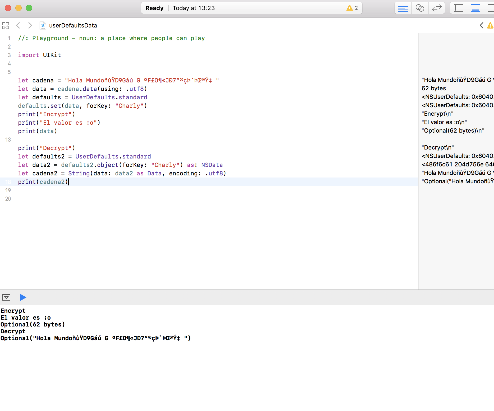

Save String As Data - Swift 
===

* In my case i use this function for a basic to encrypt.

```Swift

///Encrypt
let cadena = "Hola Mundoñ..."
let data = cadena.data(using: .utf8)
let defaults = UserDefaults.standard
defaults.set(data, forKey: "Charly")
print("Encrypt")
print("El valor es :o")
print(data)

///Decrypt
let defaults2 = UserDefaults.standard
let data2 = defaults2.object(forKey: "Charly") as! NSData
let cadena2 = String(data: data2 as Data, encoding: .utf8)
print(cadena2)
```



